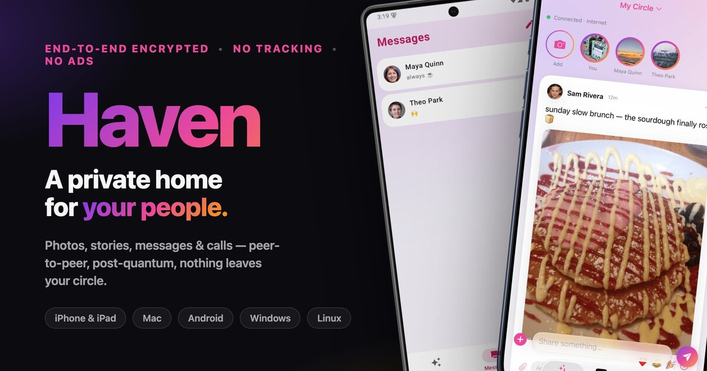

<p align="center">
  
</p>

# Haven

> Your friends *and* your family. That's the whole product.

[](LICENSE)
[](docs/ROADMAP.md)
[](#platforms)
[](docs/DECISIONS.md)

A peer-to-peer, end-to-end encrypted social network for the people you actually
know — photos, video, music, messages, and calls shared inside small circles of
friends and family. **No central server holds your content. No phone number or
email. No tracking. No ads. No doomscroll.**

Think iMessage + Apple Photos + Apple Music as a private social network — without the
ads, the surveillance, or the infinite feed. The maker runs no servers and pays
nothing monthly; your media rides on a Haven relay you (or a friend) run, your own
S3-compatible bucket, or a direct peer-to-peer link.

## What makes it different

- **No surveillance, zero operator cost.** There is no server that ever sees your
  plaintext or any personal data — and nothing the maker has to pay for monthly.
  Media rides on a Haven relay you run (any official app, or the tiny `haven-relay` on a
  Pi/server) or your own S3-compatible bucket (S3/R2/B2) — nothing else, nothing of ours.
  Peer connections use free, swappable, community/public relays only as a last-resort
  encrypted pipe. The app is **free** — no ads, no tracking, no subscription, no in-app
  purchases — so bring your friends and build your circles. It stays free of ads because
  there are no servers to pay for, and because the people who find it valuable
  [fund development directly](https://wemiller.com/support/).
- **Quantum-safe by default.** Every content key is derived from a *hybrid* of
  classical (X25519) and post-quantum (ML-KEM-768) key exchange, and every signature
  is hybrid Ed25519 + ML-DSA-65 — so stored ciphertext is protected against
  "harvest-now, decrypt-later" attacks.
- **Seedless device linking (1.0.7).** A device you link no longer has to hold a copy
  of your account master seed: it runs on **per-device keys** with an account-signed
  credential, so revoking it can cut it off **cryptographically** — from circle content
  *and* your account-state channel — not just advisorily. The seed concentrates on one
  primary device plus your encrypted iCloud-Keychain escrow. This rolls out **per-circle,
  automatically, as everyone updates** (see [Status](#status)).
- **No PII.** An account is just a keypair generated on-device. You're reachable
  by a permanent link or QR — no phone, no email, ever.
- **Local-first transport.** Traffic prefers Bluetooth, then local/peer-to-peer
  WiFi, and only falls back to a relay when there's no closer path.
- **You're in control.** Block anyone, approve every new contact, and on-device
  sensitive-content guards keep flagged media blurred — all without anything
  leaving your phone.

## Status

**1.1 is live on the App Store for iPhone, iPad, and Mac**
(https://apps.apple.com/app/id6782147901 — **1.1.0** is a reliability + polish release: multi-device
changes reconciled by who changed them last, durable story/media uploads, a rebuilt story video
camera, a much steadier feed, and story-sound previewing. It builds on **1.0.7**, the security release:
seedless device linking, the cryptographic-revocation machinery, storage management,
and an MLS-style group layer that is enabled for circles with a verified owner, i.e. the ones you
make from 1.0.7 on (existing circles keep the encryption they already have unless their creator
offers an upgrade and each member follows it) — see
[`CHANGELOG.md`](CHANGELOG.md))
and **Windows is live on the Microsoft Store**
(https://apps.microsoft.com/store/detail/9NKTFH1MF4LM).
**Android is live on Google Play**
(https://play.google.com/store/apps/details?id=com.blaineam.haven);
neither the Windows nor Android GUI app is on GitHub Releases
anymore. The **Linux** installers and
the `haven-relay` daemon still ship on GitHub Releases (free). Per the
[channel policy](docs/RELEASING.md), each platform ships through its own store and
**GitHub Releases carry only the storeless Linux + relay builds** — so you download
the paid iPhone/Mac/Android/Windows app from its store, never from a release tarball. It's been used device-to-device over the real internet and a
nearby Bluetooth/Wi-Fi mesh daily. Done so far:

- **Hybrid post-quantum core** (`haven-p2p`) — identity (Ed25519+ML-DSA, X25519+ML-KEM-768),
  AEAD seal/open, reach-me links, deterministic seed-based identity; unit-tested.
- **Real P2P transport** — sealed posts, DMs, reactions, comments, and media move
  peer-to-peer over iroh QUIC (with a nearby Bluetooth/Wi-Fi mesh fallback and a
  ttl-bounded mesh-relay), decrypted byte-identical.
- **Group keying (sender keys + epochs)** — posts and DMs are sealed under a rotating
  per-circle epoch key distributed via the hybrid KEM. Removing or blocking a **member**
  (a contact who never held your seed) rotates the epoch so they can't decrypt content
  posted after — this member removal is **cryptographic**, not advisory. The epoch also
  rotates on a **7-day periodic schedule** (driven by the sync bundle in core), so a quiet
  circle still gets bounded forward secrecy. See [`docs/GROUP-KEYING.md`](docs/GROUP-KEYING.md)
  and [`docs/SECURITY.md`](docs/SECURITY.md).
- **Seed-drop — cryptographic device revocation (1.0.7, D16 Phase 2 · S2–S5 core).** Day-to-day
  operation is re-rooted on **per-device keys** with account-signed credentials; a device linked
  through the new **seedless** flow never receives the master seed, and revoking a device can
  cut it off cryptographically — excluded from the next key commit *and* re-keyed out of the
  account-state channel — with a seedless device unable to forge a roster to re-add itself. It
  **activates per-circle** once every member's devices advertise capability (all-present-positive,
  never inferred from absence); until then a **dual-seal** coexistence path keeps un-upgraded peers
  fully working. See [`docs/SEED-DROP-DESIGN.md`](docs/SEED-DROP-DESIGN.md).
- **MLS-style group encryption — TreeKEM on our own PQ primitives (1.0.7, enabled for owner-verified circles).** A
  ratchet-tree group layer adding post-compromise security, a forward-secrecy deletion discipline,
  and per-message forward secrecy for DMs, reusing Haven's existing hybrid primitives. It is
  **MLS-*shaped*, not RFC-9420 wire-interoperable** (every ratified MLS ciphersuite is classical;
  interop would regress the PQ posture). It is **enabled in 1.0.7 for circles with a verified
  owner** — circles created from 1.0.7 on, whose id is cryptographically bound to their creator.
  **Circles you already have do not get it automatically:** they have no owner (nothing recorded who
  created them), and an owner can't be added after the fact in a way other members could trust, so
  they keep the encryption they already have — which still cuts off someone you remove. To carry an
  older circle across, whoever made it **offers an upgrade** and **each member taps once to follow
  it**; the app shows who's asking, because no signature can prove someone created a circle that
  never recorded an owner — that's a judgement only a person can make. Even on an owned circle it
  activates only **once every member's devices have updated and joined** (an all-present/all-joined
  gate); until then the circle stays on the existing key path (byte-identical to 1.0.6), and a device
  that falls behind reverts its circles to that legacy path within one sync — no one is ever
  stranded, and it only ever changes *which key* seals content, never *whether* content is
  encrypted. Its audit to date is
  an **internal**, AI-driven adversarial code review — 0 critical / 0 high — a
  strong first pass, **not** a formal external audit; an independent cryptographer's review is
  planned/ongoing. See [`docs/TREEKEM-DESIGN.md`](docs/TREEKEM-DESIGN.md).
- **Own-device sync that converges** — a user's own iPhone/iPad/Mac share the account
  identity but take **per-device transport identities**, and their divergent per-device
  epoch keys now deterministically converge (both devices adopt the numerically-larger
  key + circle secret), so posts and DMs authored — or received — on one device show up
  on the others. See [`docs/MULTI-DEVICE.md`](docs/MULTI-DEVICE.md).
- **Security-audit hardening (2026-07)** — the HTTP relay now requires a **signed auth
  header** (not a bearer token) and authorizes **per-circle membership**, failing closed;
  devroster writes are verified. WebRTC call signaling is **sealed + signed**, so a relay
  in the path can't MITM a call. Media refs are **content addresses**, verified client-side.
  Video EXIF/GPS is stripped on **every** iOS export path and on Android. Reports (`/flag`)
  are signed, store no reporter identity, and expire (90-day TTL); blocking never leaves the
  device. See [`docs/SECURITY.md`](docs/SECURITY.md).
- **Apple app (iOS / iPadOS native, macOS native)** — SwiftUI on the real Rust core via a
  UniFFI XCFramework: circles + multi-circle feed, stories (multi-clip + captions),
  DMs with recency sorting + iMessage-style conversation pinning (self-syncs across your
  devices), group DMs with per-message sender name / timestamp / delivery checkmark,
  in-app camera with filters, Apple Music on posts, **WebRTC 1:1 and group calls**
  (audio+video, screen share), **multi-identity switcher** with per-identity profiles,
  a blind-APNs notification relay with on-device NSE decrypt, and an in-app/standalone
  store-and-forward relay. macOS ships from a **native AppKit/SwiftUI target** (`HavenMac`);
  Mac Catalyst was dropped 2026-06-23.
- **Apple Watch companion** (`apple/HavenWatch`) — a thin WCSession client for messages,
  photos, reactions, and quick replies (the phone keeps the iroh node + identity).

Also shipping, with known parity gaps: a **native Android client** (`android/`, Jetpack
Compose + the same Rust core via UniFFI/Kotlin — feed, DMs, stories, media bytes, WebRTC
calls, notifications, nearby, and the DM parity + own-device sync all ported; on Google
Play's internal track) and a **Windows / Linux desktop client** (`desktop/`, Tauri 2 — the
Rust backend links the core *directly* and the same binary runs headless as your circle's
relay; Linux + relay ship on GitHub Releases, Windows installers build but the install path
is still untested on real hardware; see [`docs/WINDOWS-PORT.md`](docs/WINDOWS-PORT.md) and
[`docs/ROADMAP.md`](docs/ROADMAP.md) for the exact per-platform gaps). The web client was
abandoned (a browser can't be an iroh peer); `web/` is now just an invite-landing page. See
[`docs/ROADMAP.md`](docs/ROADMAP.md) and [`apple/README.md`](apple/README.md).

## Repository layout

```
core/        Rust workspace — the portable, security-critical core
  haven-p2p/     identity, hybrid-PQ crypto, links, social engine, transport seam
  haven-net/   iroh QUIC networking node (listen/dial, sealed payloads)
  haven-relay/ standalone store-and-forward relay daemon
  haven-s3/    shared AWS SigV4 S3 client (BYO-storage mailbox) — used by the desktop client
  haven-ffi/ UniFFI crate (`haven_ffi`) — Swift/Kotlin bindings
apple/       SwiftUI app (iOS/macOS) — consumes the core via an XCFramework
android/     Native Android app (Jetpack Compose) — same core via UniFFI/Kotlin
desktop/     Windows/Linux Tauri 2 app — Rust backend links the core directly; GUI + relay
relay/       Self-hostable relay packaging (launchd / systemd / Docker)
web/         Invite-landing / app-promo page (the web client was abandoned)
docs/        Architecture, decisions, threat model, link spec, roadmap
```

## Build & test the core

```sh
cd core
cargo test
```

## Platforms

One Rust core (`haven-p2p`) powers every client, so new platforms are mostly UI:

- **iOS / iPadOS** — SwiftUI + UniFFI (primary)
- **macOS** — native AppKit-backed SwiftUI (`HavenMac` target; Mac Catalyst dropped
  2026-06-23 — see [`docs/MACOS-NATIVE-PORT.md`](docs/MACOS-NATIVE-PORT.md))
- **Android** — native Jetpack Compose + the same core via UniFFI→Kotlin (live on
  [Google Play](https://play.google.com/store/apps/details?id=com.blaineam.haven))
- **Windows / Linux** — Tauri 2 (Rust backend links the core directly; WebView2/WebKitGTK
  UI). GUI client *and* a headless circle-relay in one binary. Linux ships `.deb` / `.rpm` /
  AppImage and a sideloadable `haven.flatpak` (Steam Deck) on **GitHub Releases** for
  **Ubuntu / Debian / Raspberry Pi OS / Arch / SteamOS**; PKGBUILDs live in-repo but Haven is
  **not on the AUR or Flathub yet** (see [`docs/LINUX.md`](docs/LINUX.md)). The `haven-relay`
  daemon cross-builds for x86_64/aarch64/armv7/armv6. The Windows GUI (x64 &amp; Arm64) is
  **live on the [Microsoft Store](https://apps.microsoft.com/store/detail/9NKTFH1MF4LM)** and is
  no longer attached to GitHub Releases. See [`docs/LINUX.md`](docs/LINUX.md) and [`docs/WINDOWS-PORT.md`](docs/WINDOWS-PORT.md)
- **Apple Watch** — glanceable companion (messages/photos/reactions/quick replies;
  not bulk video)

## License

Source-available under **PolyForm Noncommercial 1.0.0** (see [`LICENSE`](LICENSE)) —
read it, learn from it, fork it, use it noncommercially, but **not** commercially.
Copyright © Blaine Miller. The paid iOS app on the App Store is distributed by the
copyright holder. This is *source-available*, not OSI-approved open source (the
noncommercial restriction is the difference). Contributions require a CLA/DCO.

## Documentation

- [`docs/DECISIONS.md`](docs/DECISIONS.md) — the architectural decisions and why
- [`docs/ARCHITECTURE.md`](docs/ARCHITECTURE.md) — how the pieces fit together
- [`docs/SECURITY.md`](docs/SECURITY.md) — the security model in one place (crypto, what a relay can/can't do, deterrents)
- [`docs/THREAT-MODEL.md`](docs/THREAT-MODEL.md) — what we defend against, and abuse resistance
- [`docs/GROUP-KEYING.md`](docs/GROUP-KEYING.md) — epoch sender-keys: revocation + bounded forward secrecy (PQ-preserving)
- [`docs/SEED-DROP-DESIGN.md`](docs/SEED-DROP-DESIGN.md) — per-device keys + seedless linking: cryptographic device revocation (1.0.7)
- [`docs/TREEKEM-DESIGN.md`](docs/TREEKEM-DESIGN.md) — MLS-style TreeKEM on our own PQ primitives: PCS + forward secrecy (enabled in 1.0.7 for circles with a verified owner; older circles carry across only by invitation; internal audit, external review planned)
- [`docs/LINK-SYSTEM.md`](docs/LINK-SYSTEM.md) — the reach-me link / QR design
- [`docs/MULTI-DEVICE.md`](docs/MULTI-DEVICE.md) — per-device transport identity + own-device sync convergence; many-device account design ahead
- [`docs/SCHEDULED-MESSAGES.md`](docs/SCHEDULED-MESSAGES.md) — "send later" without a server
- [`docs/MEDIA-AND-MUSIC.md`](docs/MEDIA-AND-MUSIC.md) — in-app camera, Apple Music on posts, audio crossfade
- [`docs/NOTIFICATIONS.md`](docs/NOTIFICATIONS.md) — blind APNs relay + on-device NSE decrypt
- [`docs/RELAY-AND-DEPLOY.md`](docs/RELAY-AND-DEPLOY.md) — relay roles, BYO storage, IP privacy, the deploy tool
- [`docs/HAVEN-NET-RELAY.md`](docs/HAVEN-NET-RELAY.md) — routing the relay/mailbox over Haven Net (no public host)
- [`docs/LORA-DESIGN.md`](docs/LORA-DESIGN.md) — off-grid text over LoRa/Meshtastic radio: the compact wire profile the link would need (design spike, not built)
- [`docs/SATELLITE-DESIGN.md`](docs/SATELLITE-DESIGN.md) — Haven over carrier satellite data (T-Satellite): the ultra-constrained path APIs, low-data mode's policy table, and the carrier-allowlist problem (mode shipped in 1.6.0; carrier admission still a design question)
- [`docs/PREVIEW-TIER-DESIGN.md`](docs/PREVIEW-TIER-DESIGN.md) — a 512px AVIF preview tier (~6 KB) that crosses a satellite link first and upgrades to the full copy on return (design, not built)
- [`docs/BYO-STORAGE.md`](docs/BYO-STORAGE.md) — bring-your-own S3 / cloud-drive storage
- [`docs/OPERATING-COSTS.md`](docs/OPERATING-COSTS.md) — $0 operator cost model
- [`docs/EXPORT-COMPLIANCE.md`](docs/EXPORT-COMPLIANCE.md) — US export-compliance (automated)
- [`docs/MACOS-NATIVE-PORT.md`](docs/MACOS-NATIVE-PORT.md) — Mac Catalyst → native AppKit/SwiftUI port
- [`docs/ANDROID-PARITY.md`](docs/ANDROID-PARITY.md) — the native Android client plan + status
- [`docs/WINDOWS-PORT.md`](docs/WINDOWS-PORT.md) — the Windows/Linux Tauri desktop client plan + status
- [`docs/LINUX.md`](docs/LINUX.md) — Linux GUI + headless relay: per-distro install (Ubuntu/Debian/Raspbian/Arch/SteamOS), packaging, parity
- [`docs/WEB-PARITY.md`](docs/WEB-PARITY.md) — why the web client was abandoned
- [`docs/ROADMAP.md`](docs/ROADMAP.md) — milestones and prerequisites
